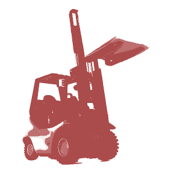

<p align='center'>
    
</p>
# forklift.js


## A node.js library for the [Crate](crate.io) database

## Status

- [x] Table
- [x] Schema: Columns
- [x] Schema: Generated Columns
- [x] Schema: Fulltext Index Columns
- [x] Expressions: Standard
- [x] Expressions: Fulltext Match
- [x] Select
- [x] Row: Insert
- [ ] Row: Delete
- [ ] Row: Update

## Usage

Install. Clone. etc.

Stand up a Crate cluster, visit 0.0.0.0:4200.
```
docker-compose up -d seed && docker-compose scale member=2
```

Initialize and connect the client.
Note: see ./test/readme-test.js for a runnable version of the following.
```
var forklift = require('forklift');
var cql = forklift.cql;
forklift.connect();
```

Create a table and schema with a few columns.
```
var table = new cql.Table('games')
    .create()
    .columns([
        new cql.Column('id').type('integer').primary(),
        new cql.Column('name').type('string').required(),
        new cql.Column('awesomeness').type('integer'),
        new cql.Column('platform').type('string')
    ])
    .clusterColumn('id')
    .clusterShards(3)
    .with({
        column_policy: 'strict',
        number_of_replicas: '0-all'
    });

forklift.send(table)
    .then(function (res) {
        console.log(res.responseCode, res.message);
        // 200 'OK'
    });
```

Make some data.
```
var data = [
    {
        id: 1,
        name: 'Uncharted 4: A Thief\'s End',
        awesomeness: 4,
        platform: 'PS4'
    },
    {
        id: 2,
        name: 'Last of Us',
        awesomeness: 5,
        platform: 'PS3'
    },
    {
        id: 3,
        name: 'Grand Theft Auto: Episodes from Liberty City',
        awesomeness: 2,
        platform: 'PS3'
    },
    {
        id: 4,
        name: 'Fallout 3',
        awesomeness: 4,
        platform: 'PC'
    },
    {
        id: 5,
        name: 'Far Cry 3',
        awesomeness: 3,
        platform: 'PS3'
    },
    {
        id: 6,
        name: 'Call of Duty: Black Ops 3',
        awesomeness: 2,
        platform: 'PS4'
    }
];
```

Dump some data into the table.
```
var insert = new cql.Insert()
    .into('games')
    .bulk(data);

forklift.send(insert)
    .then(function (res) {
        console.log(res.responseCode, res.message);
        // 200 'OK'
    });
```

Query the data.
```
var query = new cql.Select()
    .all()
    .from('games')
    .where(
        new cql.Expression()
            .gt('awesomeness', 2)
            .and()
            .eq('platform', 'PS3')
    )
    .orderBy('awesomeness');

forklift.send(query)
    .then(function (res) {
        console.log('query results:');
        res.data.forEach(function (d) {
            console.log(`${d.id}, ${d.name}, ${d.platform}, ${d.awesomeness}`);
        });
    });
```

Drop the table.
```
table.drop();

forklift.send(table)
    .then(function (res) {
        console.log(res.responseCode, res.message);
    });
```

#### SQL Test Data
Pulled from [StackExchange Data Explorer](http://data.stackexchange.com/stackoverflow/query/new)
- `stackoverflow-posts.json` The top 100 posts with 1000+ votes.
- `stackoverflow-users.json` The top 1000 users by reputation from `stackoverflow-users.json`.
